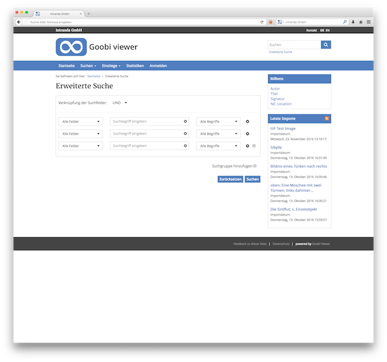
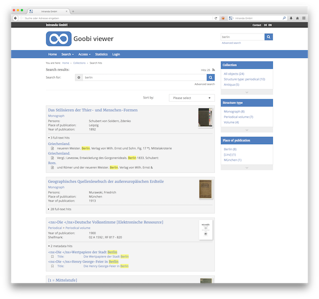
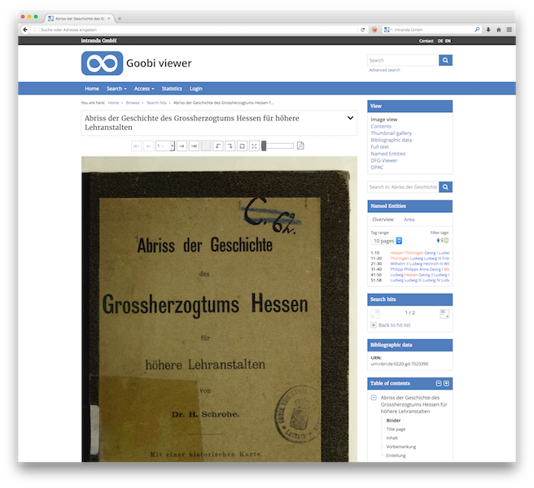
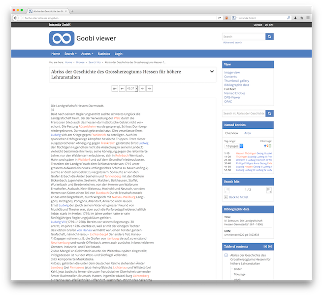
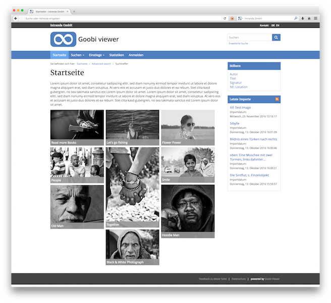
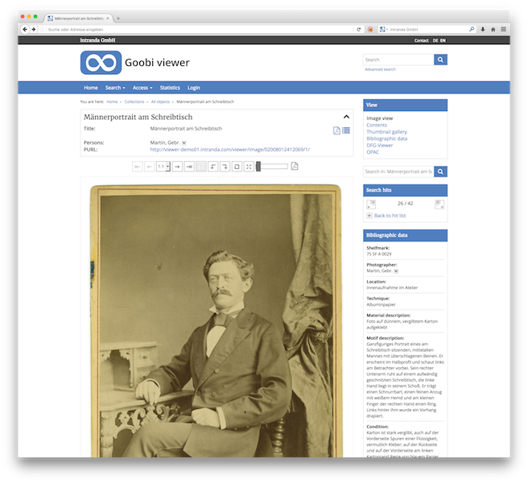
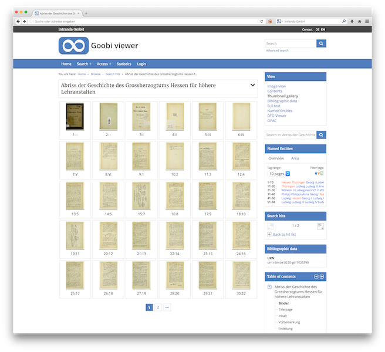
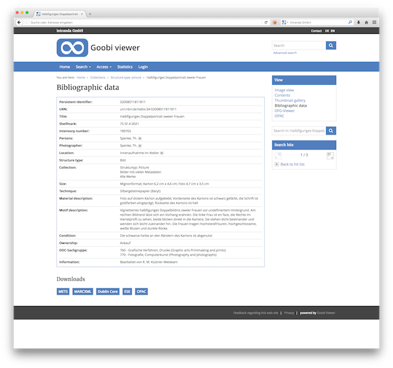
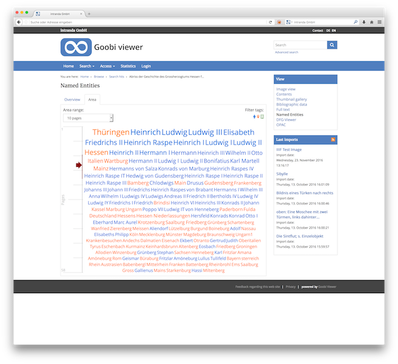
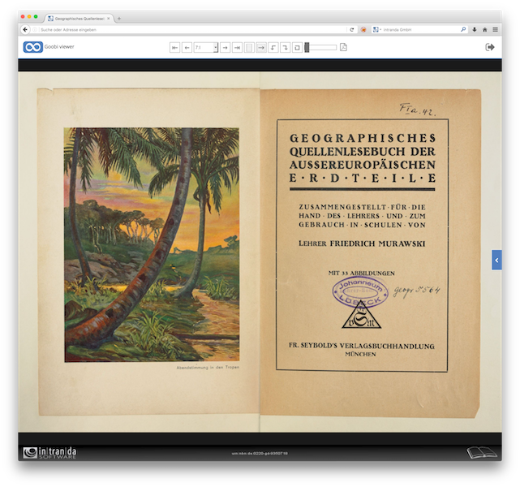

# Goobi viewer - Theme Reference
> Theme reference as clean and easy theme for your digital library framework - made by the Goobi developer team

## Beautiful and clean user interface for your digital library based on Goobi
This theme reference is a clean easy to use web interface for the Goobi viewer. It is based on Bootstrap and offers an easy way to get you started building your own design to adapt the styling of your digital library to look like your individual corporate design.

We encourage you to fork this project and to build lots of different themes based on this structure. This allows all of use to benefit from your design creativity.

## Screenshots
Please find here some screenshot of how the current design of this Reference Theme looks like:

<table>
<tr>
<td></td>
<td></td>
</tr>
<tr>
<td></td>
<td></td>
</tr>
<tr>
<td></td>
<td></td>
</tr>
<tr>
<td></td>
<td></td>
</tr>
<tr>
<td></td>
<td></td>
</tr>
</table>

More screenshots can be found in the folder doc/images. Please try to create comparable screenshots of your own theme in case you fork and publish it too.

## Documentation
A complete documentation of the Goobi viewer can be found using this URL:  
<http://www.intranda.com/en/digiverso/documentation/>

Please notice that the Goobi viewer was formerly known as proprietary software under the name 'intranda viewer' and is released under an open source license since June 2017. Lots of our documentation and description sites still have to be updated to represent the new product name 'Goobi viewer'.

## Technical background

The Goobi viewer indexer is part of the Goobi viewer project which consists of multiple packages:

| Package | Function |
| ------ | ------ |
| [Goobi viewer core](https://github.com/intranda/goobi-viewer-core) | Core functionality of the viewer application|
| [Goobi viewer indexer](https://github.com/intranda/goobi-viewer-indexer) | Indexing application to fill the Solr search index with metadata information |
| [Goobi viewer connector](https://github.com/intranda/goobi-viewer-connector) | Connectors for different use cases (incl. OAI-PMH, SRU)|
| [Goobi viewer Theme Reference](https://github.com/intranda/goobi-viewer-theme-reference) | Reference Theme for the styling of the web pages for the user interface |

## Installation
The installation can be done on any operating system as the software is based on Java. A detailed explanation how to install the viewer will follow later on. In the mean time please get in touch with us via <info@intranda.com>

## Release History
Detailed release note descriptions can be found using this URL:  
<http://www.intranda.com/en/digiverso/intranda-viewer/history/>

## Developer team
intranda GmbH  
Bertha-von-Suttner-Str. 9  
37085 Göttingen  
Germany

## Contact us
If you would like to get in touch with the developers please use the following contact details:

| Contact |Address |
| ------ | ------ |
| Website | <http://www.intranda.com> |
| Mail | <info@intranda.com> |
| Twitter intranda | <http://twitter.com/intranda> |
| Twitter Goobi | <http://twitter.com/goobi> |
| Github | <https://github.com/intranda> |

## Licence
The Goobi viewer connector is released under the license GPL2 or later.  
Please see ``LICENSE`` for more information.

## Contributing

1. Fork it (<https://github.com/intranda/goobi-viewer-connector/fork>)
2. Create your feature branch (`git checkout -b feature/fooBar`)
3. Commit your changes (`git commit -am 'Add some fooBar'`)
4. Push to the branch (`git push origin feature/fooBar`)
5. Create a new Pull Request

